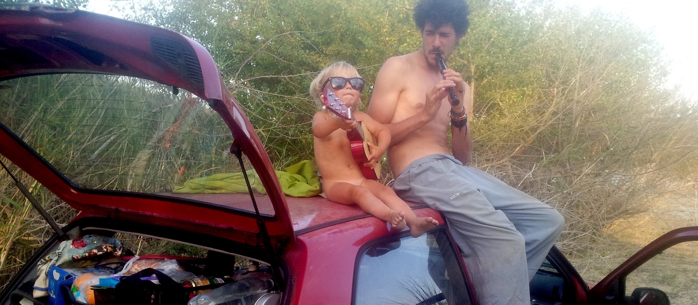

## Back to roots, back to earth



To balance, to peace, to simplicity and pureness with intelligent ways & new points of view.

We respond to this calling to be a human being with a truly open and creativity living experience

You, us, we.

Material, practical objects and things, in totally mirrored of ideals and beliefs

All one with bridges of co-creative love, showing this another world that is already here.

Enjoy with harmony

---
>don't say:
>
>« i am too small or don't have the responsability to save the world
>
>say:
>
>« i — and only i — have the responsibility to save the world

```
mistake happen when you want to control the bad weather

feel the vibrations of the fear & pain

we care about it

we care about the unknown

material world is not. the symbols yes

by the symbols we affects the spirit of people

we are tired of listening

just the good thing, just that

the power that we cannot explain

it will decide at the end

feelings, matters... why is the universe here ?

real freedom and life

filled with passion

full of experiences

happyness

evolution is to go back & accept again 
```
